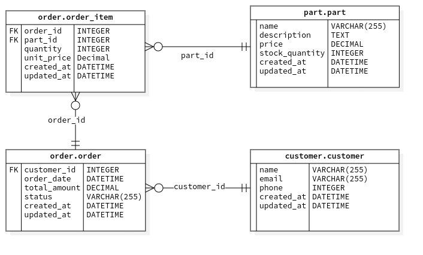

# Hello World App

This tutorial will guide you through creating your first Django application using a simple order management system. This documentation assumes that you have already created a blank project from the Getting Started docs.

---

## Step 1: Create an Entity-Relationship Diagram (ERD)

Begin by designing an Entity-Relationship Diagram (ERD) for your database. This visual representation helps you understand the relationships between different entities in your application. For this tutorial, we'll use a basic ERD that includes the following entities:

- **Customers**
- **Orders**
- **Inventory**

To convert your ERD into Django models, you can use the **Py_StarUML** tool. Refer to the [Py_StarUML documentation](https://github.com/your-repo/Py_StarUML) for instructions on generating code from your ERD.

See the [Py_StarUML docs](pystaruml) for more details. 



---

## Step 2: Set Up Your Apps

Within your existing Django project, you'll need to create separate apps for `orders`, `customers`, and `inventory`. Navigate to your project directory and run:

```bash
python manage.py startapp orders
python manage.py startapp customers
python manage.py startapp inventory
```

**Note:** Due to the separation of configuration and app files in the Django Cookiecutter structure, you may need to move the newly created app directories into the correct location within your project.

For example, if your project structure places apps in a `project_slug` directory, move the apps accordingly:

```bash
mv orders project_slug/
mv customers project_slug/
mv inventory project_slug/
```

---

## Step 3: Integrate Py_StarUML Output

Copy the models, views, and urls generated by Py_StarUML into the files of their respective apps. 

---

## Step 4: Configure Your Project

### Update Installed Apps

In your project's settings file (usually located at `settings/base.py`), add your new apps to the `LOCAL_APPS` list:

```python
LOCAL_APPS = [
    # Other local apps...
    'customers',
    'orders',
    'inventory',
]
```

### Update URLs

In your project's main `urls.py` file (e.g., `config/urls.py`), include the URLs for each app:

```python
from django.urls import path, include

urlpatterns = [
    # Existing paths...
    path('customers/', include('project_slug.customers.urls')),
    path('orders/', include('project_slug.orders.urls')),
    path('inventory/', include('project_slug.inventory.urls')),
]
```

Ensure that each app has a `urls.py` file. If not, create one in each app directory.

### Update App Configurations

In each app's `apps.py` file, update the `name` attribute to include the project slug. For example, in `project_slug/orders/apps.py`:

```python
from django.apps import AppConfig

class OrdersConfig(AppConfig):
    default_auto_field = 'django.db.models.BigAutoField'
    name = 'project_slug.orders'
```

Repeat this step for the `customers` and `inventory` apps.

---

## Step 5: Finalize the Setup

Apply migrations to create the database schema:

```bash
python manage.py makemigrations
python manage.py migrate
```

Run the development server:

```bash
python manage.py runserver
```

Your application should now be running at `http://127.0.0.1:8000/`.

---

## Additional Notes

- **Configuration Adjustments:** Since the project is generated using Django Cookiecutter, review your configuration files for any settings that may need adjustment, such as database configurations, static files settings, or allowed hosts.

- **Views and Templates:** By default, models use the default views. To create custom views (e.g., Master-Detail views), define them in each app's `views.py` and create corresponding templates in the `templates` directory.

- **URL Patterns:** Ensure that your `urls.py` files in each app correctly map URLs to views.

---

## Conclusion

You've successfully set up a simple order management system using Django and Django Cookiecutter. This foundational application can be expanded by adding more features, refining models, and improving the user interface. 